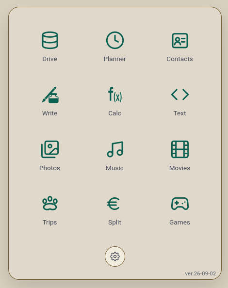

# Nayive

Personal web apps you host yourself: Drive, Planner (calendar, tasks and habits),
Contacts, Write, Calc, Text, Photos, Music, Movies, Trips, Split and Games.

<p align="center"></p>

- One static Go binary (`server/go/`) serves the apps and a small JSON file API.
- Multi-user. Each user's data is plain files (`.ics`, `.vcf`, `.json`) in their own folder.
- No database, no framework, no build step for the apps.
- Installable as a PWA, with native notifications (Web Push).

## Install

```sh
./pack.sh                 # builds nayive.zip (needs Go 1.24+ and zip)
unzip nayive.zip -d nayive
cd nayive
./install.sh              # writes store/config/server.json and a systemd unit
```

Then open `http://localhost:4343/nayive/admin.html` and create the admin account.

## Run from source

```sh
mkdir -p store/config store/homes
cp store/config/server.example.json store/config/server.json
cd server/go
go run . -config ../../store/config/server.json   # http://localhost:4343/nayive/
```

## Deploy to your own server

```sh
cp deploy.local.sh.example deploy.local.sh   # your VPS user, host and SSH port
./deploy.sh
```

## Layout

| Folder | What it holds |
|---|---|
| `server/go/` | the server (Go) |
| `client/` | `apps/`: what the browser loads |
| `store/` | the run-root: settings and every user's data (git-ignored) |
| `tools/` | build and check helpers (Go) |

## License

[Apache 2.0](LICENSE)
